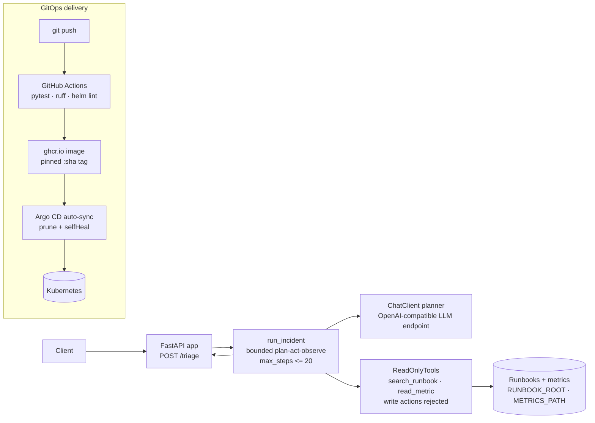

# Incident triage agent

[Architecture](#architecture) · [Measured results](#measured-results) · [Setup](#setup) ·
[Usage](#usage) · [API reference](#api-reference) · [Deployment](#deployment) ·
[Project structure](#project-structure) · [CI status](#ci-status) ·
[docs/architecture.md](docs/architecture.md) · [docs/operations.md](docs/operations.md) ·
[Helm chart](k8s/helm/incident-triage-agent/) · [Argo CD application](k8s/argocd/application.yaml)

A FastAPI service that triages incidents through a **bounded plan–act–observe agent
loop with read-only tools and an action allowlist**. The agent can only
`search_runbook`, `read_metric`, or `finish`; any write-like action is rejected
and recorded in the audit trace, and `finish` must cite successful observation
steps as evidence. It is a reference implementation — it has not been deployed
to a production cluster.

## Architecture



Full design notes live in [docs/architecture.md](docs/architecture.md) and
[docs/operations.md](docs/operations.md). Key safety properties (enforced by
`src/service/agents.py` and covered by tests):

- **Read-only tools.** `ReadOnlyTools.execute` only knows `search_runbook`
  (keyword match over mounted `*.md` runbooks) and `read_metric` (lookup in a
  JSON object); anything else returns `{"error": "tool not allowed"}`.
- **Bounded loop.** `run_incident` runs at most `max_steps` turns (1–20) and
  returns `status: step_limit` if the planner never finishes.
- **Evidence-gated finish.** A `finish` action is accepted only when its summary
  is non-empty and every cited `step:N` is a successful observation; otherwise
  the trace records `finish must cite successful observation steps`.
- **Human review boundary.** The summary is a suggestion, not an automated
  remediation; the system never changes infrastructure.

## Measured results

All numbers below were measured by running the repo's own code on 2026-09-23
(local machine, uvicorn on loopback, synthetic reference data — not production
traffic). The service is a reference implementation; these are engineering
measurements, not business claims.

| What | Result | How measured |
|---|---|---|
| Test suite | 4 passed, 0 failed | `python -m pytest -q` |
| Lint | clean | `ruff check .` |
| `POST /triage` latency (p50) | 16.6 ms | n=200 sequential requests, local uvicorn, `max_steps: 2` |
| `POST /triage` latency (p95) | 44.3 ms | same run; one earlier warm-up run measured p50 22.7 ms / p95 88.5 ms |
| Helm chart | `helm lint --strict` passes; `helm template` renders (default and `autoscaling.enabled=true,networkPolicy.enabled=true` variants); rendered manifests pass client-side structural validation | helm v3, 2026-09-23 |

Latency setup: `RUNBOOK_ROOT`/`METRICS_PATH` pointed at two small synthetic
runbooks plus a metrics JSON in `/tmp`; `LLM_BASE_URL` pointed at a local stub
OpenAI-compatible planner (each request does 2 stub LLM round-trips through the
full plan–act–observe loop). With a real inference endpoint, LLM latency
dominates.

## Setup

```sh
python -m pip install -e '.[test]'
python -m pytest -q
ruff check .
helm lint k8s/helm/incident-triage-agent --strict
```

Copy [`.env.example`](.env.example) to `.env` and fill in values (placeholders
only — never commit credentials). The service needs:

- `RUNBOOK_ROOT` — directory of approved `*.md` runbooks (default `/data/runbooks`)
- `METRICS_PATH` — JSON object of read-only numeric metrics (default `/data/metrics.json`)
- `LLM_BASE_URL` / `LLM_MODEL` — OpenAI-compatible inference endpoint (HTTPS or
  localhost only); `/triage` returns 503 without it
- `LLM_API_KEY` — supplied from a secret manager, never Helm plaintext values

## Usage

```sh
uvicorn service.app:app --host 127.0.0.1 --port 8000
```

```sh
# Liveness / readiness
curl localhost:8000/health/live
curl localhost:8000/health/ready   # 503 until runbooks + metrics are present

# Triage an incident
curl -X POST localhost:8000/triage \
  -H 'Content-Type: application/json' \
  -d '{"description": "p99 latency spike on the checkout API during peak hours", "max_steps": 6}'
```

Example response:

```json
{
  "status": "completed",
  "summary": "Check queue depth and consumer lag.",
  "evidence": ["step:2"],
  "trace": [
    {"step": 1, "decision": {"action": "search_runbook", "query": "latency"},
     "observation": {"matches": [{"name": "latency", "text": "..."}]}},
    {"step": 2, "decision": {"action": "read_metric", "name": "queue_depth"},
     "observation": {"name": "queue_depth", "value": 42}},
    {"step": 3, "decision": {"action": "finish", "summary": "Check queue depth and consumer lag.", "evidence": ["step:2"]}}
  ]
}
```

Responses include a request ID and no-store/nosniff headers; JSON request logs
omit bodies and query strings.

## API reference

| Method & path | Description |
|---|---|
| `GET /health/live` | Process liveness. Always `{"status": "alive"}` when running. |
| `GET /health/ready` | 200 `{"status": "ready"}` when runbooks and metrics load; 503 otherwise. |
| `POST /triage` | Body: `{"description": str (5–2000 chars), "max_steps": int (1–12, default 6)}`. Returns `{"status": "completed" \| "step_limit", "summary": str, "evidence": [str], "trace": [object]}`. 503 if tool data or the inference endpoint is unavailable. |

## Deployment

**Docker.** `Dockerfile` installs the package as a non-root user (uid 10001) and
serves `uvicorn service.app:app` on port 8000.

**Helm.** The chart at [`k8s/helm/incident-triage-agent/`](k8s/helm/incident-triage-agent/)
ships with a `ConfigMap` (`config.data`) for non-secret settings (`RUNBOOK_ROOT`,
`METRICS_PATH`), wired into the pod via `envFrom`; `env` accepts extra plain
vars and `envFromSecretName` wires secrets such as `LLM_API_KEY`. Tunables
include replica count, resources, probes, PDB, HPA, and NetworkPolicy (see
`values.yaml` / `values.schema.json` and the chart's `NOTES.txt`). The pinned
`image.tag` is managed by CI — do not edit it by hand. Mount runbooks and
metrics via `volumes`/`volumeMounts`.

**Argo CD / GitOps.** Push to `main` → GitHub Actions builds and pushes
`ghcr.io/saimudunuri04/incident-triage-agent:<commit-sha>`, pins that tag in
`values.yaml`, and Argo CD auto-syncs the change (prune + selfHeal) into the
cluster per [`k8s/argocd/application.yaml`](k8s/argocd/application.yaml).
Manifests were validated with `helm lint --strict`, `helm template`, and
client-side YAML structure checks (no live cluster was available for
`kubectl --dry-run=client`); **not applied to a live cluster**. Provide the
`LLM_API_KEY` Secret out of band before the first sync.

## Project structure

```
.
├── src/service/
│   ├── app.py            # FastAPI routes (/triage, /health/*), env wiring
│   ├── agents.py         # run_incident loop, ReadOnlyTools allowlist
│   ├── llm.py            # ChatClient: minimal OpenAI-compatible chat adapter
│   └── observability.py  # Request IDs, security headers, JSON request logging
├── tests/
│   ├── test_service.py        # allowlist rejection, step budget, evidence gating
│   └── test_observability.py
├── k8s/helm/incident-triage-agent/  # Chart, values, values.schema.json, templates (incl. ConfigMap, NOTES.txt)
├── k8s/argocd/application.yaml      # Argo CD Application manifest
├── docs/                 # architecture.md, operations.md
├── Dockerfile
├── .env.example
└── pyproject.toml
```

## CI status

The [`test-build`](.github/workflows/ci.yml) workflow runs on every push and
pull request: `ruff check .`, `python -m pytest -q`, `helm lint --strict`, and
two `helm template` variants (default and `autoscaling.enabled=true,
networkPolicy.enabled=true`). On `main`, the `publish` job builds the Docker
image, pushes it to GHCR as `:<commit-sha>`, and pins that tag in the chart's
`values.yaml` so Argo CD rolls out the tested image. The workflow does not
provision AWS or a cluster.

## License

MIT — see [LICENSE](LICENSE).
